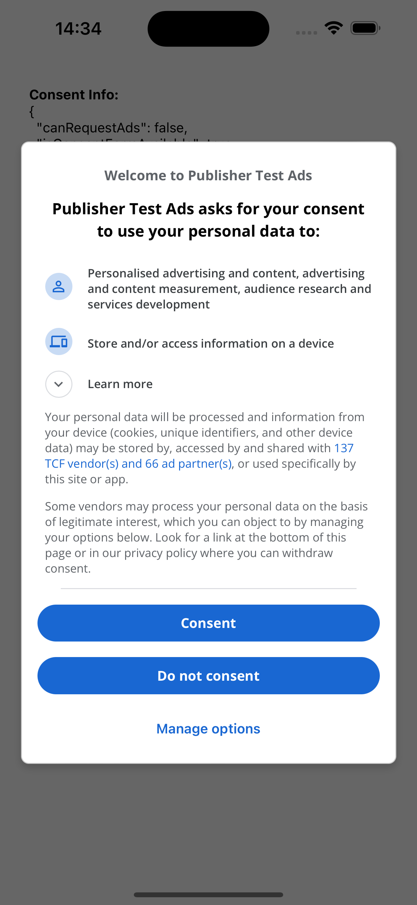

  <a href="https://docs.page/nvappsltd/google-ump-react-native">
    
    
     
  </a>
  <h2 align="center">Google UMP React Native</h2>

  
  
  

---

Integrating Google's User Messaging Platform (UMP) with React Native, this library offers a direct, 1:1 integration with the official [iOS](https://developers.google.com/admob/ios/privacy) and [Android](https://developers.google.com/admob/android/privacy) SDKs.

✅ Actively maintained, it keeps pace with the latest updates from Google's Official UMP SDKs.

## Documentation

- [Introduction](https://docs.page/nvappsltd/google-ump-react-native)
- [Installation](https://docs.page/nvappsltd/google-ump-react-native/installation)
- [Usage](https://docs.page/nvappsltd/google-ump-react-native/usage)

## Contributing

- [Issues](https://github.com/nvappsltd/google-ump-react-native/issues)
- [PRs](https://github.com/nvappsltd/google-ump-react-native/pulls)

## License

- See [LICENSE](/LICENSE)

---

  
  

    Built and maintained by <a href="https://nvapps.co/?utm_source=readme&utm_medium=footer&utm_campaign=google-ump-react-native">nvapps</a>.
  

